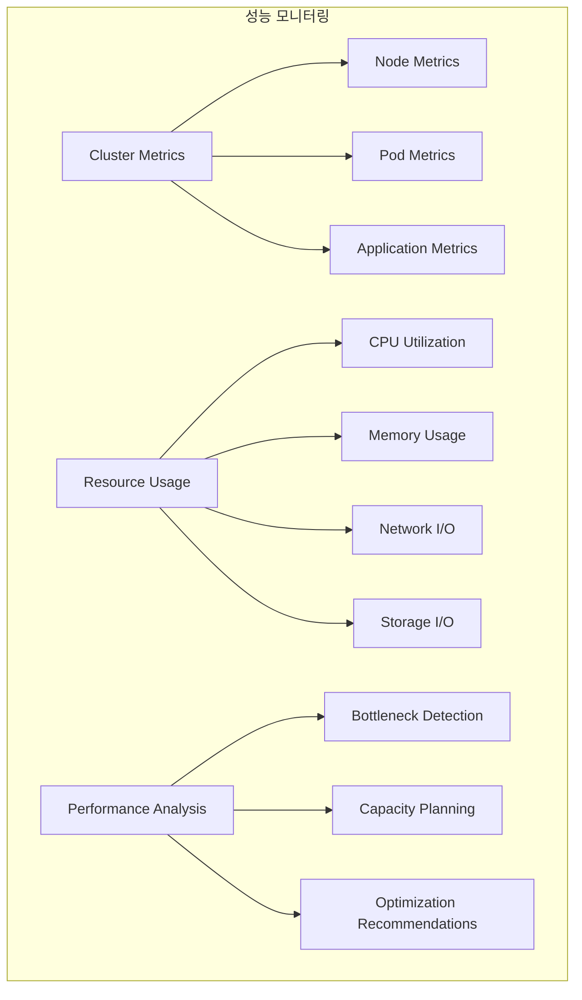
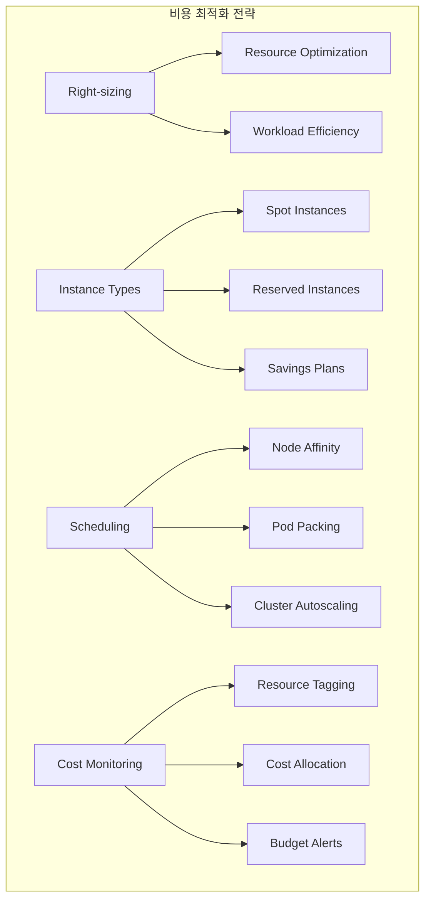

# Session 5: 성능 튜닝과 비용 최적화

## 📍 교과과정에서의 위치
이 세션은 **Week 3 > Day 5 > Session 5**로, Kubernetes 클러스터의 성능 튜닝과 비용 최적화 전략을 학습합니다.

## 학습 목표 (5분)
- **클러스터 성능 분석**과 **튜닝** 방법 이해
- **리소스 사용률 최적화**와 **효율성** 향상 기법 학습
- **클라우드 비용 관리** 전략과 **비용 최적화** 방법 파악
- **스팟 인스턴스**와 **예약 인스턴스** 활용 전략 습득

## 1. 클러스터 성능 분석과 튜닝 (12분)

### 성능 모니터링 아키텍처



### 성능 분석 및 튜닝 상세 가이드

```
Kubernetes 성능 분석 및 튜닝:

1. 성능 메트릭 수집 및 분석:
   🔹 클러스터 레벨 메트릭:
      • 전체 리소스 사용률:
         • CPU 사용률 (전체 클러스터 대비)
         • 메모리 사용률 (전체 클러스터 대비)
         • 스토리지 사용률 (PV/PVC 기준)
         • 네트워크 대역폭 사용률
      • 클러스터 상태 메트릭:
         • 노드 Ready/NotReady 상태
         • Pod 스케줄링 성공/실패율
         • API Server 응답 시간
         • etcd 성능 지표
      • 스케줄링 효율성:
         • Pending Pod 수 및 원인
         • 리소스 단편화 정도
         • 노드 간 부하 분산 상태
         • 어피니티/안티어피니티 효과
      • 확장성 지표:
      • 오토스케일링 반응 시간
      • 노드 추가/제거 시간
      • Pod 시작 시간
      • 서비스 디스커버리 지연
   🔹 노드 레벨 메트릭:
      • 하드웨어 리소스:
         • CPU 사용률 (코어별, 프로세스별)
         • 메모리 사용률 (사용/캐시/버퍼)
         • 디스크 I/O (읽기/쓰기 IOPS, 처리량)
         • 네트워크 I/O (패킷/바이트 수)
      • 시스템 성능:
         • Load Average (1분, 5분, 15분)
         • Context Switch 빈도
         • 인터럽트 처리 시간
         • 시스템 콜 지연시간
      • 컨테이너 런타임:
         • Docker/containerd 성능
         • 이미지 풀 시간
         • 컨테이너 시작/중지 시간
         • 오버레이 파일시스템 성능
      • 네트워크 성능:
      • CNI 플러그인 성능
      • 서비스 메시 오버헤드
      • DNS 해상도 시간
      • 로드밸런싱 지연
   🔹 Pod 레벨 메트릭:
      • 리소스 사용량:
         • CPU 사용률 (요청/제한 대비)
         • 메모리 사용률 (요청/제한 대비)
         • 임시 스토리지 사용량
         • 네트워크 트래픽 패턴
      • 애플리케이션 성능:
         • 응답 시간 (P50, P95, P99)
         • 처리량 (RPS, TPS)
         • 에러율 및 실패 패턴
         • 큐 길이 및 대기 시간
      • 라이프사이클 메트릭:
         • Pod 시작 시간
         • 준비 상태 도달 시간
         • 재시작 빈도 및 원인
         • 종료 시간 (Graceful shutdown)
      • 의존성 성능:
      • 외부 서비스 호출 지연
      • 데이터베이스 쿼리 시간
      • 캐시 히트율
      • 메시지 큐 처리 시간
   🔹 애플리케이션 레벨 메트릭:
   🔹 비즈니스 메트릭:
      • 사용자 세션 수
      • 트랜잭션 처리량
      • 비즈니스 로직 처리 시간
      • 사용자 경험 지표
   🔹 기술적 메트릭:
      • JVM/런타임 성능 (해당시)
      • 가비지 컬렉션 시간
      • 스레드 풀 사용률
      • 커넥션 풀 상태
   🔹 보안 메트릭:
      • 인증/인가 처리 시간
      • TLS 핸드셰이크 지연
      • 보안 스캔 결과
      • 취약점 탐지 알림
   🔹 데이터 메트릭:
   🔹 데이터 처리량
   🔹 데이터 품질 지표
   🔹 백업/복구 성능
   🔹 데이터 일관성 검증

2. 성능 병목 지점 식별:
   🔹 CPU 병목:
      • 증상:
         • 높은 CPU 사용률 (>80%)
         • 높은 Load Average
         • Context Switch 증가
         • 응답 시간 증가
      • 원인 분석:
         • CPU 집약적 워크로드
         • 비효율적인 알고리즘
         • 무한 루프 또는 데드락
         • 부적절한 리소스 할당
      • 해결 방안:
         • CPU 리소스 증가
         • 워크로드 분산
         • 알고리즘 최적화
         • 캐싱 전략 도입
      • 모니터링:
      • CPU 사용률 추이
      • 프로세스별 CPU 사용량
      • 스레드 덤프 분석
      • 프로파일링 도구 활용
   🔹 메모리 병목:
      • 증상:
         • 높은 메모리 사용률 (>85%)
         • OOMKilled 이벤트 발생
         • 스왑 사용량 증가
         • 가비지 컬렉션 빈발
      • 원인 분석:
         • 메모리 누수
         • 대용량 데이터 처리
         • 캐시 크기 부적절
         • 메모리 리소스 부족
      • 해결 방안:
         • 메모리 리소스 증가
         • 메모리 누수 수정
         • 캐시 정책 최적화
         • 데이터 처리 방식 개선
      • 모니터링:
      • 메모리 사용률 패턴
      • 힙 덤프 분석
      • 가비지 컬렉션 로그
      • 메모리 프로파일링
   🔹 네트워크 병목:
      • 증상:
         • 높은 네트워크 지연
         • 패킷 드롭 발생
         • 대역폭 포화
         • DNS 해상도 지연
      • 원인 분석:
         • 네트워크 대역폭 부족
         • CNI 플러그인 성능 이슈
         • 서비스 메시 오버헤드
         • 네트워크 정책 복잡성
      • 해결 방안:
         • 네트워크 대역폭 증가
         • CNI 플러그인 최적화
         • 트래픽 라우팅 개선
         • 캐싱 전략 강화
      • 모니터링:
      • 네트워크 트래픽 패턴
      • 지연시간 분포
      • 패킷 손실률
      • 대역폭 사용률
   🔹 스토리지 병목:
   🔹 증상:
      • 높은 디스크 I/O 대기
      • 스토리지 응답 시간 증가
      • 디스크 큐 길이 증가
      • 파일시스템 성능 저하
   🔹 원인 분석:
      • 디스크 I/O 집약적 워크로드
      • 스토리지 성능 한계
      • 파일시스템 단편화
      • 부적절한 스토리지 클래스
   🔹 해결 방안:
      • 고성능 스토리지 사용
      • I/O 패턴 최적화
      • 캐싱 레이어 추가
      • 스토리지 클래스 변경
   🔹 모니터링:
   🔹 디스크 I/O 메트릭
   🔹 스토리지 지연시간
   🔹 처리량 패턴
   🔹 파일시스템 상태

3. 성능 튜닝 전략:
   🔹 리소스 최적화:
      • Right-sizing:
         • 실제 사용량 기반 리소스 조정
         • 과도한 리소스 할당 방지
         • 리소스 요청/제한 최적화
         • 주기적인 사용량 검토
      • 수직 확장 (Vertical Scaling):
         • CPU/메모리 증가
         • VPA 활용한 자동 조정
         • 성능 테스트 기반 결정
         • 비용 대비 효과 분석
      • 수평 확장 (Horizontal Scaling):
         • 레플리카 수 증가
         • HPA 설정 최적화
         • 로드 분산 개선
         • 상태 관리 고려
      • 리소스 할당 정책:
      • QoS 클래스 최적화
      • 우선순위 클래스 설정
      • 리소스 쿼터 관리
      • LimitRange 정책
   🔹 스케줄링 최적화:
      • 노드 어피니티:
         • 하드웨어 특성 기반 배치
         • 지역/가용영역 고려
         • 성능 요구사항 매칭
         • 비용 효율성 고려
      • Pod 어피니티/안티어피니티:
         • 관련 서비스 근접 배치
         • 고가용성을 위한 분산
         • 네트워크 지연 최소화
         • 리소스 경합 방지
      • 테인트와 톨러레이션:
         • 전용 노드 활용
         • 특수 워크로드 격리
         • 유지보수 시 배제
         • 하드웨어 장애 대응
      • 커스텀 스케줄러:
      • 특수 요구사항 대응
      • 비즈니스 로직 반영
      • 고급 배치 전략
      • 성능 최적화 알고리즘
   🔹 네트워크 최적화:
      • CNI 플러그인 선택:
         • 성능 벤치마크 비교
         • 기능 요구사항 매칭
         • 운영 복잡성 고려
         • 보안 요구사항 충족
      • 서비스 메시 최적화:
         • 사이드카 리소스 튜닝
         • 트래픽 정책 최적화
         • 관찰 가능성 설정
         • 보안 정책 균형
      • 로드 밸런싱:
         • 알고리즘 선택 최적화
         • 헬스체크 설정 조정
         • 세션 어피니티 고려
         • 트래픽 분산 전략
      • DNS 최적화:
      • CoreDNS 설정 튜닝
      • DNS 캐싱 전략
      • 외부 DNS 연동
      • DNS 정책 최적화
   🔹 애플리케이션 최적화:
   🔹 컨테이너 이미지:
      • 멀티스테이지 빌드 활용
      • 베이스 이미지 최적화
      • 레이어 캐싱 전략
      • 보안 스캔 통합
   🔹 시작 시간 최적화:
      • Init Container 활용
      • 의존성 사전 로딩
      • 설정 외부화
      • 헬스체크 최적화
   🔹 리소스 사용 패턴:
      • 메모리 사용 최적화
      • CPU 사용 패턴 개선
      • I/O 최적화
      • 캐싱 전략 구현
   🔹 관찰 가능성:
   🔹 메트릭 수집 최적화
   🔹 로깅 전략 개선
   🔹 트레이싱 구현
   🔹 프로파일링 도구 활용
```

### 비용 최적화 전략



### 비용 최적화 실무 가이드

```
클라우드 비용 최적화 핵심 전략:

1. 스팟 인스턴스 활용:
   🔹 개념: 여유 인스턴스를 저렴한 가격에 사용 (50-90% 절약)
   🔹 적용 워크로드: 상태 비저장, 배치 처리, 개발/테스트
   🔹 구현 전략: 다양한 인스턴스 타입 혼합, 자동 대체
   🔹 주의사항: 중단 대비 전략 필수

2. 예약 인스턴스:
   🔹 1-3년 약정으로 30-60% 절약
   🔹 예측 가능한 워크로드에 적합
   🔹 전체 선불 vs 부분 선불 옵션
   🔹 활용률 모니터링 필수

3. Right-sizing:
   🔹 실제 사용량 기반 리소스 조정
   🔹 VPA 활용한 자동 최적화
   🔹 과도한 할당 30-50% 비용 절약
   🔹 주기적 리뷰 및 조정

4. 비용 모니터링:
   🔹 리소스 태깅으로 비용 할당
   🔹 실시간 비용 대시보드
   🔹 예산 초과 알림 시스템
   🔹 비용 최적화 권장사항 자동 생성
```

## 💬 그룹 토론: 성능 vs 비용 최적화 균형점 (8분)

### 토론 주제
**"클러스터 성능을 유지하면서도 비용을 최적화하는 균형점을 찾기 위한 전략은 무엇인가?"**

### 토론 가이드라인

#### 성능 요구사항 (3분)
- SLA 준수: 서비스 수준 협약 유지
- 사용자 경험: 응답 시간과 가용성
- 확장성: 트래픽 증가 대응 능력

#### 비용 최적화 방법 (3분)
- 리소스 효율성: 적절한 크기 조정
- 인스턴스 전략: 스팟, 예약 인스턴스 활용
- 자동화: 스케일링과 스케줄링 최적화

#### 균형점 찾기 (2분)
- 우선순위: 성능과 비용의 우선순위 설정
- 측정 지표: 효과를 측정할 수 있는 KPI
- 지속적 개선: 모니터링과 최적화 프로세스

## 💡 핵심 개념 정리
- 성능 튜닝: 클러스터 메트릭 분석, 병목 지점 식별, 최적화
- 리소스 최적화: Right-sizing, 효율적 스케줄링, 자동 스케일링
- 비용 관리: 인스턴스 전략, 리소스 태깅, 예산 관리
- 균형점: 성능 요구사항과 비용 효율성의 최적 조합

## 📚 참고 자료
- [Kubernetes Performance Tuning](https://kubernetes.io/docs/concepts/cluster-administration/system-metrics/)
- [Cloud Cost Optimization](https://aws.amazon.com/aws-cost-management/)
- [Spot Instance Best Practices](https://docs.aws.amazon.com/AWSEC2/latest/UserGuide/spot-best-practices.html)
- [Resource Management Guide](https://kubernetes.io/docs/concepts/configuration/manage-resources-containers/)

## 다음 세션 준비
다음 세션에서는 **트러블슈팅과 문제 해결**에 대해 학습합니다. 일반적인 Kubernetes 문제 패턴과 디버깅 기법을 다룰 예정입니다.