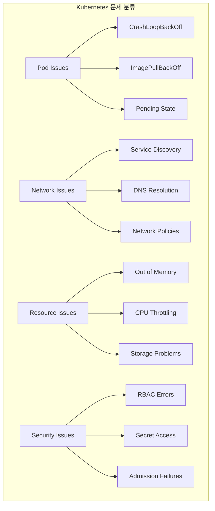
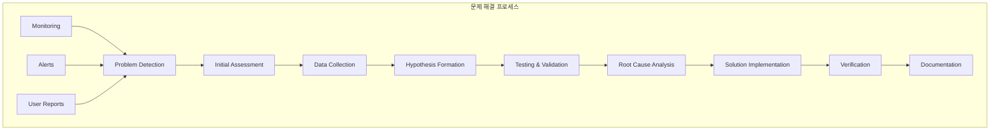
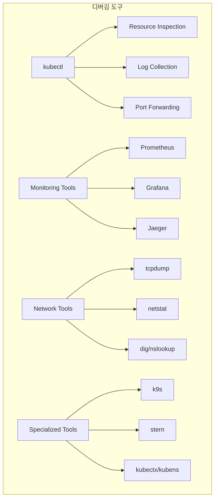
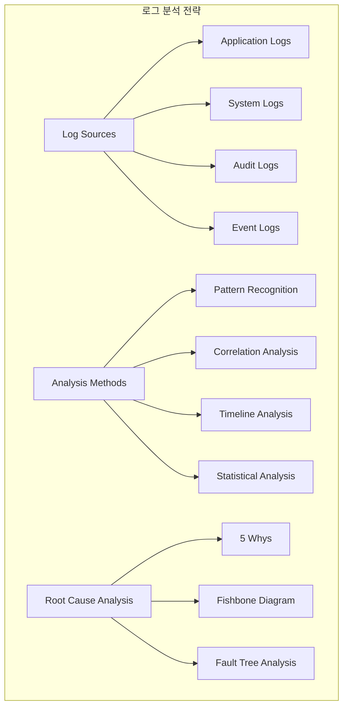

# Session 6: 트러블슈팅과 문제 해결

## 📍 교과과정에서의 위치
이 세션은 **Week 3 > Day 5 > Session 6**으로, Kubernetes 환경에서의 트러블슈팅과 체계적인 문제 해결 방법을 학습합니다.

## 학습 목표 (5분)
- **일반적인 Kubernetes 문제** 패턴과 **원인 분석** 방법 이해
- **디버깅 도구**와 **기법**을 활용한 **문제 진단** 능력 학습
- **로그 분석**과 **근본 원인 분석**을 통한 **해결 방법** 파악
- **문제 해결 프로세스**와 **문서화** 모범 사례 습득

## 1. 일반적인 Kubernetes 문제 패턴 (12분)

### 문제 분류 체계

### 문제 해결 워크플로우

## 2. 디버깅 도구와 기법 (10분)

### 디버깅 도구 생태계

## 3. 로그 분석과 근본 원인 분석 (15분)

### 로그 분석 전략

## 💬 그룹 토론: 효과적인 트러블슈팅 문화 구축 (8분)

### 토론 주제
**"팀 내에서 효과적인 트러블슈팅 문화를 구축하고 지식을 공유하기 위한 방법은 무엇인가?"**

### 토론 가이드라인

#### 문화적 요소 (3분)
- **학습 문화**: 실패를 통한 학습과 지식 공유
- **협업**: 팀 간 협력과 지식 전수
- **문서화**: 문제 해결 과정과 결과 기록

#### 프로세스 개선 (3분)
- **표준화**: 일관된 문제 해결 프로세스
- **자동화**: 반복적인 진단 작업 자동화
- **도구**: 효과적인 디버깅 도구와 환경

#### 역량 개발 (2분)
- **교육**: 지속적인 기술 교육과 훈련
- **멘토링**: 경험자와 초보자 간 지식 전수
- **실습**: 실제 문제 상황을 통한 경험 축적

## 💡 핵심 개념 정리
- **문제 패턴**: Pod, 네트워크, 리소스, 보안 관련 일반적 문제
- **디버깅 도구**: kubectl, 모니터링 도구, 네트워크 도구 활용
- **근본 원인 분석**: 체계적 분석 방법과 문제 해결 프로세스
- **문화 구축**: 학습 문화, 협업, 문서화를 통한 조직 역량 강화

## 📚 참고 자료
- [Kubernetes Troubleshooting Guide](https://kubernetes.io/docs/tasks/debug-application-cluster/)
- [kubectl Cheat Sheet](https://kubernetes.io/docs/reference/kubectl/cheatsheet/)
- [Debugging Kubernetes Applications](https://kubernetes.io/docs/tasks/debug-application-cluster/debug-application/)
- [Site Reliability Engineering](https://sre.google/books/)

## 다음 세션 준비
다음 세션에서는 **멀티 클러스터와 하이브리드 클라우드**에 대해 학습합니다. 멀티 클러스터 아키텍처와 하이브리드 클라우드 전략을 다룰 예정입니다.