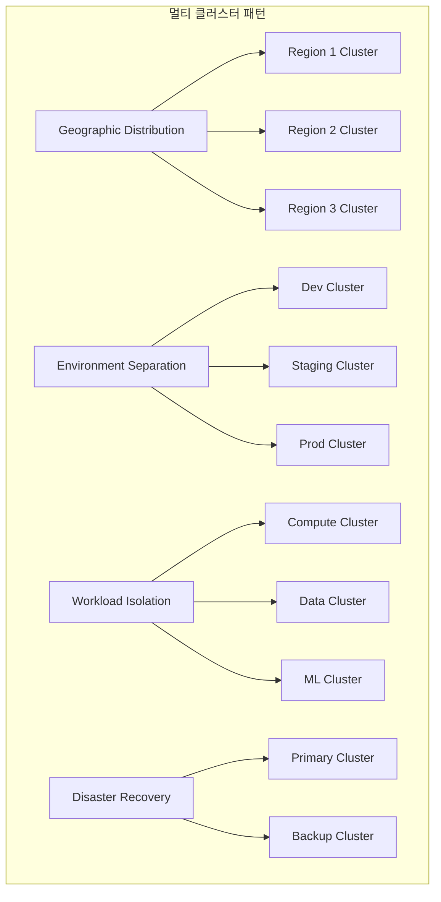
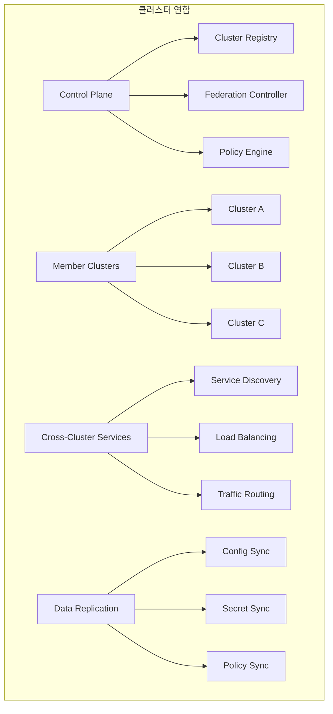
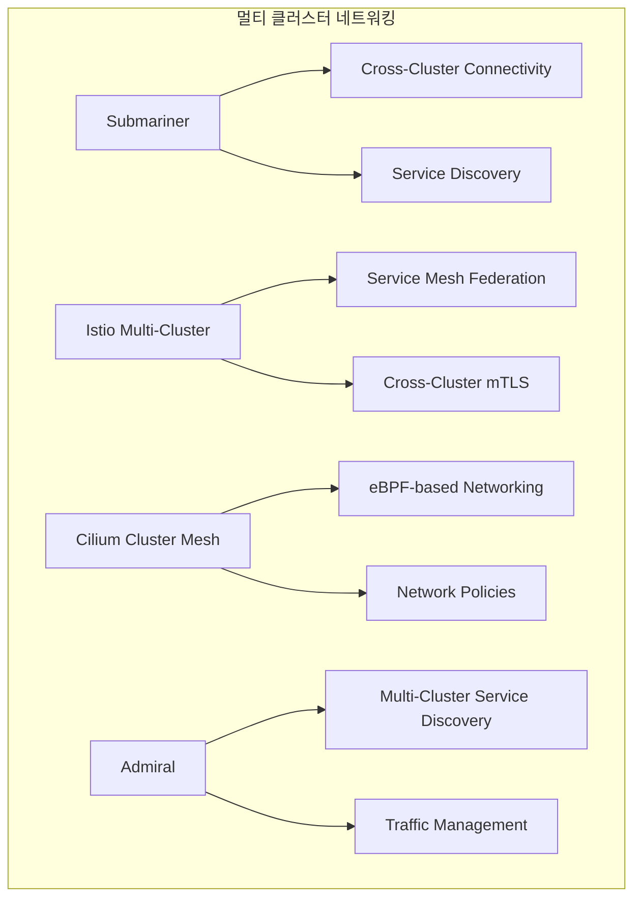
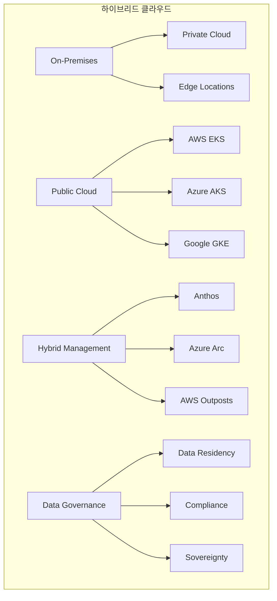

# Session 7: 멀티 클러스터와 하이브리드 클라우드

## 📍 교과과정에서의 위치
이 세션은 **Week 3 > Day 5 > Session 7**로, 멀티 클러스터 아키텍처와 하이브리드 클라우드 전략을 학습합니다.

## 학습 목표 (5분)
- **멀티 클러스터 아키텍처** 패턴과 **설계 원칙** 이해
- **클러스터 간 네트워킹**과 **서비스 메시** 연동 방법 학습
- **하이브리드 클라우드** 전략과 **구현 방안** 파악
- **데이터 주권**과 **컴플라이언스** 고려사항 습득

## 1. 멀티 클러스터 아키텍처 패턴 (12분)

### 멀티 클러스터 패턴



### 멀티 클러스터 아키텍처 상세 분석

```
멀티 클러스터 아키텍처 패턴:

1. 지리적 분산 (Geographic Distribution):
   🔹 개념:
      • 전 세계 여러 지역에 클러스터 배치
      • 사용자와 가까운 위치에서 서비스 제공
      • 지역별 데이터 주권 및 규제 준수
      • 네트워크 지연 최소화
   🔹 장점:
      • 낮은 지연시간 (Low Latency)
         • 사용자와 물리적 거리 단축
         • CDN과 유사한 효과
         • 실시간 애플리케이션 성능 향상
         • 사용자 경험 개선
      • 고가용성 (High Availability)
         • 지역적 장애 대응
         • 자연재해 영향 최소화
         • 인프라 다양성 확보
         • 서비스 연속성 보장
      • 규제 준수 (Compliance)
         • 데이터 거주 요구사항 충족
         • 지역별 법규 준수
         • 개인정보 보호 규정 대응
         • 산업별 규제 요구사항
      • 확장성 (Scalability)
      • 지역별 독립적 확장
      • 트래픽 분산 효과
      • 리소스 최적화
      • 비용 효율성
   🔹 구현 고려사항:
      • 데이터 동기화
         • 지역 간 데이터 일관성
         • 복제 지연 관리
         • 충돌 해결 전략
         • 백업 및 복구 계획
      • 네트워크 연결
         • 지역 간 전용선 구축
         • VPN 연결 설정
         • 대역폭 관리
         • 보안 통신 보장
      • 운영 복잡성
         • 다중 클러스터 관리
         • 모니터링 통합
         • 배포 조정
         • 문제 해결 프로세스
      • 비용 관리
      • 지역별 비용 차이
      • 데이터 전송 비용
      • 운영 인력 배치
      • 인프라 중복 투자
   🔹 사용 사례:
   🔹 글로벌 서비스 (Netflix, Amazon)
   🔹 금융 서비스 (지역별 규제)
   🔹 게임 서비스 (낮은 지연시간 필요)
   🔹 IoT 플랫폼 (엣지 컴퓨팅)

2. 환경별 분리 (Environment Separation):
   🔹 개념:
      • 개발, 스테이징, 프로덕션 환경 분리
      • 각 환경별 독립적인 클러스터 운영
      • 환경 간 격리를 통한 안정성 확보
      • 단계별 배포 및 테스트 지원
   🔹 환경별 특성:
      • 개발 환경 (Development)
         • 개발자 개인 작업 공간
         • 빠른 반복 개발 지원
         • 리소스 제약 완화
         • 실험적 기능 테스트
      • 스테이징 환경 (Staging)
         • 프로덕션과 유사한 환경
         • 통합 테스트 수행
         • 성능 테스트 실행
         • 배포 전 최종 검증
      • 프로덕션 환경 (Production)
         • 실제 서비스 운영
         • 최고 수준의 안정성
         • 엄격한 변경 관리
         • 24/7 모니터링
      • 추가 환경
      • QA 환경 (품질 보증)
      • UAT 환경 (사용자 수용 테스트)
      • 데모 환경 (고객 시연)
      • 교육 환경 (사용자 교육)
   🔹 장점:
      • 위험 격리
         • 개발 실수가 프로덕션에 영향 없음
         • 실험적 변경 안전하게 수행
         • 장애 영향 범위 제한
         • 복구 시간 단축
      • 품질 보장
         • 단계별 검증 프로세스
         • 자동화된 테스트 수행
         • 성능 검증 기회
         • 사용자 피드백 수집
      • 규제 준수
         • 감사 추적 용이성
         • 변경 승인 프로세스
         • 데이터 보호 강화
         • 컴플라이언스 요구사항 충족
      • 운영 효율성
      • 환경별 최적화 가능
      • 리소스 사용량 예측 가능
      • 문제 해결 시간 단축
      • 팀 간 협업 개선
   🔹 구현 전략:
      • 환경 동등성 (Environment Parity)
         • 동일한 인프라 구성
         • 같은 버전의 도구 사용
         • 유사한 데이터 세트
         • 일관된 설정 관리
      • 자동화된 프로모션
         • CI/CD 파이프라인 통합
         • 자동 배포 스크립트
         • 승인 워크플로우
         • 롤백 메커니즘
      • 데이터 관리
         • 테스트 데이터 생성
         • 개인정보 마스킹
         • 데이터 동기화
         • 백업 전략
      • 모니터링 통합
      • 환경별 메트릭 수집
      • 통합 대시보드
      • 알림 정책 차별화
      • 로그 중앙화
   🔹 모범 사례:
   🔹 Infrastructure as Code 사용
   🔹 환경별 설정 외부화
   🔹 자동화된 테스트 수행
   🔹 정기적인 환경 동기화
   🔹 보안 정책 일관성 유지
   🔹 비용 모니터링 및 최적화

3. 워크로드 격리 (Workload Isolation):
   🔹 개념:
      • 서로 다른 유형의 워크로드를 별도 클러스터에서 실행
      • 성능 요구사항에 따른 클러스터 최적화
      • 보안 요구사항에 따른 격리
      • 리소스 경합 방지
   🔹 워크로드 유형별 분류:
      • 컴퓨팅 집약적 (Compute Intensive)
         • CPU 최적화된 인스턴스
         • 고성능 프로세서
         • 병렬 처리 지원
         • 스케일 아웃 아키텍처
      • 메모리 집약적 (Memory Intensive)
         • 대용량 메모리 인스턴스
         • 인메모리 데이터베이스
         • 캐싱 시스템
         • 빅데이터 처리
      • I/O 집약적 (I/O Intensive)
         • 고성능 스토리지
         • 네트워크 최적화
         • 데이터베이스 워크로드
         • 로그 처리 시스템
      • GPU 워크로드
         • 머신러닝 훈련
         • 과학 계산
         • 그래픽 렌더링
         • 암호화폐 마이닝
      • 배치 처리
      • 스케줄된 작업
      • 데이터 ETL
      • 리포트 생성
      • 백업 작업
   🔹 격리 전략:
      • 하드웨어 격리
         • 전용 노드 사용
         • 특화된 하드웨어
         • 성능 예측 가능성
         • 리소스 경합 방지
      • 네트워크 격리
         • 별도 VPC/서브넷
         • 네트워크 정책 적용
         • 트래픽 분리
         • 보안 강화
      • 스토리지 격리
         • 전용 스토리지 클래스
         • 성능 티어 분리
         • 데이터 보안 강화
         • 백업 정책 차별화
      • 운영 격리
      • 별도 운영 팀
      • 전용 모니터링
      • 독립적 배포
      • 맞춤형 SLA
   🔹 구현 고려사항:
   🔹 비용 효율성 분석
   🔹 운영 복잡성 관리
   🔹 리소스 활용률 최적화
   🔹 크로스 클러스터 통신
   🔹 통합 모니터링 구축

4. 재해 복구 (Disaster Recovery):
   🔹 개념:
      • 주 클러스터 장애 시 백업 클러스터로 전환
      • 비즈니스 연속성 보장
      • 데이터 손실 최소화
      • 복구 시간 단축
   🔹 DR 전략:
      • 액티브-패시브 (Active-Passive)
         • 주 클러스터에서만 서비스
         • 백업 클러스터는 대기 상태
         • 장애 시 수동 또는 자동 전환
         • 비용 효율적
      • 액티브-액티브 (Active-Active)
         • 두 클러스터 모두 서비스
         • 로드 분산 효과
         • 즉시 장애 대응
         • 높은 비용
      • 파일럿 라이트 (Pilot Light)
         • 최소한의 백업 환경
         • 핵심 구성 요소만 실행
         • 장애 시 신속한 확장
         • 중간 수준의 비용
      • 웜 스탠바이 (Warm Standby)
      • 축소된 백업 환경
      • 주요 서비스 실행 중
      • 빠른 확장 가능
      • 균형잡힌 비용/성능
   🔹 구현 요소:
      • 데이터 복제
         • 실시간 또는 배치 복제
         • 데이터 일관성 보장
         • 복제 지연 모니터링
         • 충돌 해결 메커니즘
      • 자동 장애 감지
         • 헬스체크 시스템
         • 모니터링 알림
         • 자동 전환 트리거
         • 거짓 양성 방지
      • 트래픽 라우팅
         • DNS 기반 전환
         • 로드밸런서 설정
         • CDN 연동
         • 지리적 라우팅
      • 복구 절차
      • 자동화된 복구 스크립트
      • 수동 검증 단계
      • 데이터 동기화
      • 서비스 검증
   🔹 테스트 및 검증:
   🔹 정기적인 DR 테스트
   🔹 복구 시간 측정
   🔹 데이터 무결성 검증
   🔹 절차 문서 업데이트
   🔹 팀 교육 및 훈련
```

### 클러스터 연합 아키텍처



## 2. 클러스터 간 네트워킹과 서비스 메시 (10분)

### 네트워킹 솔루션



## 3. 하이브리드 클라우드 전략과 데이터 주권 (15분)

### 하이브리드 클라우드 아키텍처



## 💬 그룹 토론: 멀티 클러스터 도입 전략 (8분)

### 토론 주제
**"조직에서 멀티 클러스터 아키텍처를 도입할 때 고려해야 할 핵심 요소와 단계적 접근 방법은 무엇인가?"**

### 토론 가이드라인

#### 도입 동기 (3분)
- **비즈니스 요구사항**: 지역별 서비스, 규제 준수, 가용성
- **기술적 요구사항**: 확장성, 격리, 성능 최적화
- **운영적 요구사항**: 관리 복잡성, 비용 효율성

#### 구현 전략 (3분)
- **단계적 접근**: 단일 클러스터에서 멀티 클러스터로 점진적 전환
- **도구 선택**: 클러스터 관리 도구와 네트워킹 솔루션
- **거버넌스**: 정책, 보안, 컴플라이언스 관리

#### 운영 고려사항 (2분)
- **복잡성 관리**: 운영 오버헤드와 관리 도구
- **모니터링**: 통합 모니터링과 관찰 가능성
- **재해 복구**: 클러스터 간 백업과 복구 전략

## 💡 핵심 개념 정리
- **멀티 클러스터**: 지역별, 환경별, 워크로드별 클러스터 분산
- **네트워킹**: 클러스터 간 연결성과 서비스 메시 통합
- **하이브리드 클라우드**: 온프레미스와 퍼블릭 클라우드 통합
- **데이터 주권**: 규제 준수와 데이터 거버넌스

## 📚 참고 자료
- [Kubernetes Multi-Cluster Management](https://kubernetes.io/docs/concepts/cluster-administration/cluster-management/)
- [Istio Multi-Cluster](https://istio.io/latest/docs/setup/install/multicluster/)
- [Submariner Documentation](https://submariner.io/getting-started/)
- [CNCF Multi-Cluster Working Group](https://github.com/cncf/wg-multicluster)

## 다음 세션 준비
다음 세션에서는 **Kubernetes 실무 종합과 미래 전망**에 대해 학습합니다. Week 3 전체 내용을 종합하고 실무 적용 로드맵을 수립할 예정입니다.