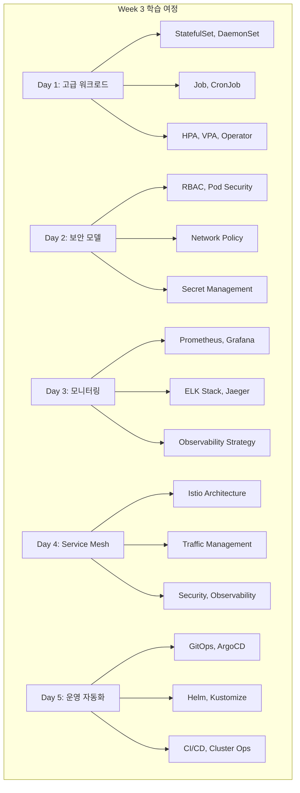
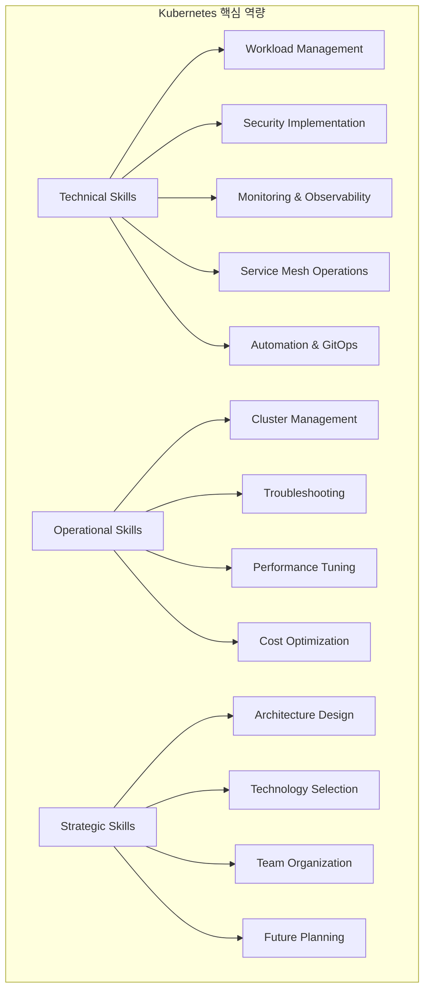
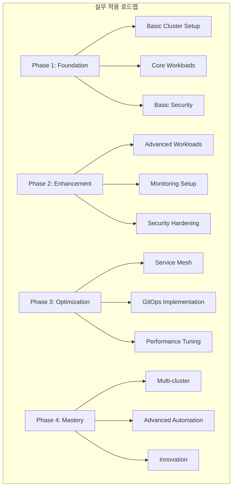
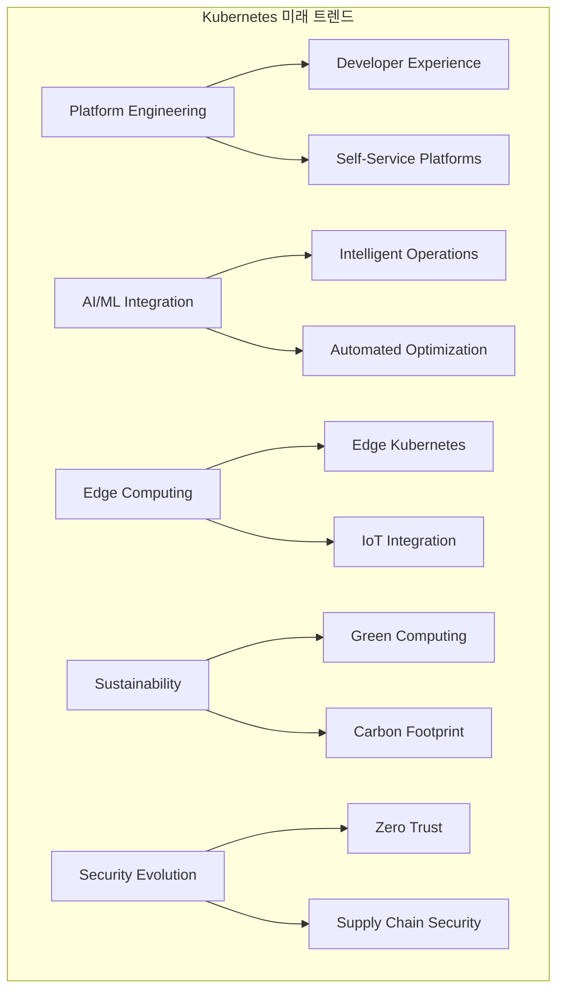

# Session 8: Kubernetes 실무 종합과 미래 전망

## 📍 교과과정에서의 위치
이 세션은 **Week 3 > Day 5 > Session 8**로, Week 3 전체 내용을 종합하고 Kubernetes 실무 적용과 미래 전망을 다룹니다.

## 학습 목표 (5분)
- **Week 3 전체 내용** 종합 정리와 **핵심 개념** 통합 이해
- **실무 적용 로드맵** 수립과 **단계적 구현** 전략 학습
- **Kubernetes 생태계** 트렌드와 **기술 발전** 방향 파악
- **차세대 기술**과 **미래 전망** 분석 및 **준비 방안** 습득

## 1. Week 3 전체 내용 종합 정리 (12분)

### Week 3 학습 여정



### 핵심 역량 매트릭스



### Week 3 핵심 개념 통합
```
Week 3 종합 정리:

Day 1 - 고급 워크로드 관리:
├── StatefulSet과 상태 관리:
│   ├── 순서 보장 배포
│   ├── 안정적인 네트워크 식별자
│   ├── 영구 스토리지 관리
│   ├── 데이터베이스 워크로드 최적화
│   └── 백업 및 복구 전략
├── DaemonSet과 시스템 서비스:
│   ├── 노드별 필수 서비스 배포
│   ├── 로그 수집 및 모니터링 에이전트
│   ├── 네트워크 및 스토리지 플러그인
│   ├── 보안 에이전트 배포
│   └── 시스템 유지보수 작업
├── Job과 배치 처리:
│   ├── 일회성 작업 실행
│   ├── 병렬 처리 및 완료 조건
│   ├── CronJob을 통한 스케줄링
│   ├── 실패 처리 및 재시도
│   └── 리소스 관리 및 정리
└── 자동 스케일링과 Operator:
    ├── HPA/VPA를 통한 동적 스케일링
    ├── 커스텀 메트릭 기반 스케일링
    ├── Operator 패턴과 CRD
    ├── 복잡한 애플리케이션 생명주기 관리
    └── 자동화된 운영 작업

Day 2 - 보안 모델:
├── RBAC과 접근 제어:
│   ├── 사용자 및 서비스 계정 관리
│   ├── 역할 기반 권한 부여
│   ├── 네임스페이스별 권한 분리
│   ├── 최소 권한 원칙 적용
│   └── 감사 및 컴플라이언스
├── Pod 보안과 정책:
│   ├── Pod Security Standards
│   ├── Security Context 설정
│   ├── 컨테이너 보안 강화
│   ├── 런타임 보안 모니터링
│   └── 취약점 스캔 및 관리
├── 네트워크 보안:
│   ├── Network Policy를 통한 트래픽 제어
│   ├── 마이크로 세그멘테이션
│   ├── Ingress 보안 설정
│   ├── 서비스 메시 보안 통합
│   └── 네트워크 모니터링
└── 시크릿 관리:
    ├── Kubernetes Secrets 활용
    ├── 외부 시크릿 관리 시스템 통합
    ├── 암호화 및 키 관리
    ├── 시크릿 로테이션
    └── 보안 모범 사례

Day 3 - 모니터링과 관찰 가능성:
├── 메트릭 수집과 분석:
│   ├── Prometheus 아키텍처와 구성
│   ├── 메트릭 타입과 수집 전략
│   ├── ServiceMonitor/PodMonitor 설정
│   ├── PromQL 쿼리와 알림 규칙
│   └── 성능 최적화
├── 로그 관리:
│   ├── 중앙집중식 로깅 아키텍처
│   ├── ELK 스택 구성과 운영
│   ├── Fluentd/Fluent Bit 로그 수집
│   ├── 로그 분석과 검색
│   └── 보존 정책과 아카이브
├── 분산 추적:
│   ├── OpenTelemetry 표준
│   ├── Jaeger 아키텍처와 구성
│   ├── 추적 샘플링 전략
│   ├── 성능 분석과 최적화
│   └── 마이크로서비스 디버깅
└── 통합 모니터링 전략:
    ├── 관찰 가능성 3요소 통합
    ├── SLI/SLO/SLA 정의와 측정
    ├── 알림과 인시던트 관리
    ├── 대시보드 설계와 시각화
    └── 모니터링 조직과 문화

Day 4 - Service Mesh:
├── Istio 아키텍처:
│   ├── 컨트롤 플레인과 데이터 플레인
│   ├── Envoy 프록시와 사이드카 패턴
│   ├── istiod 컴포넌트 (Pilot, Citadel, Galley)
│   ├── 설치와 구성 관리
│   └── 멀티 클러스터 Service Mesh
├── 트래픽 관리:
│   ├── Virtual Service와 Destination Rule
│   ├── 가중치 기반 라우팅
│   ├── 카나리 배포와 A/B 테스트
│   ├── 서킷 브레이커와 재시도 정책
│   └── 고급 라우팅 패턴
├── 보안과 mTLS:
│   ├── 제로 트러스트 보안 모델
│   ├── 자동 mTLS 구성
│   ├── 인증 정책과 권한 부여
│   ├── 보안 네임스페이스 격리
│   └── 인증서 관리
└── 관찰 가능성:
    ├── 분산 추적 통합
    ├── Kiali를 통한 시각화
    ├── 메트릭 수집과 분석
    ├── 성능 모니터링
    └── 문제 해결과 디버깅

Day 5 - 운영 자동화:
├── GitOps와 선언적 배포:
│   ├── GitOps 원칙과 워크플로우
│   ├── ArgoCD 아키텍처와 구성
│   ├── Git 기반 설정 관리
│   ├── 동기화와 드리프트 감지
│   └── 멀티 클러스터 GitOps
├── 패키지 관리:
│   ├── Helm 차트 설계와 템플릿
│   ├── Kustomize 오버레이와 패치
│   ├── 패키지 버전 관리
│   ├── 의존성 해결
│   └── 하이브리드 접근법
├── CI/CD 통합:
│   ├── Kubernetes 네이티브 CI/CD
│   ├── 파이프라인 보안과 시크릿 관리
│   ├── 테스트 자동화와 품질 게이트
│   ├── 배포 전략과 롤백
│   └── 공급망 보안
└── 클러스터 운영:
    ├── 클러스터 업그레이드 전략
    ├── 노드 관리와 오토스케일링
    ├── 백업과 재해 복구
    ├── 성능 튜닝과 비용 최적화
    └── 트러블슈팅과 문제 해결
```

## 2. 실무 적용 로드맵 수립 (10분)

### 실무 적용 단계



## 3. Kubernetes 생태계 트렌드와 미래 전망 (15분)

### 기술 트렌드 분석



### 차세대 기술 전망
```
Kubernetes 생태계 미래 전망:

플랫폼 엔지니어링 (Platform Engineering):
├── 개발자 경험 향상:
│   ├── 셀프 서비스 플랫폼 구축
│   ├── 추상화 레이어 제공
│   ├── 개발자 도구 통합
│   ├── 인지 부하 감소
│   └── 생산성 극대화
├── 내부 개발자 플랫폼 (IDP):
│   ├── 표준화된 개발 환경
│   ├── 자동화된 인프라 프로비저닝
│   ├── 통합된 CI/CD 파이프라인
│   ├── 모니터링과 관찰 가능성 내장
│   └── 보안과 컴플라이언스 자동화
├── 플랫폼 팀 조직:
│   ├── 제품 중심 사고방식
│   ├── 개발자 고객 중심
│   ├── 플랫폼 API 설계
│   ├── 사용자 피드백 수집
│   └── 지속적 개선
└── 도구 생태계:
    ├── Backstage: 개발자 포털
    ├── Crossplane: 클라우드 리소스 관리
    ├── Kratix: 플랫폼 구축 프레임워크
    ├── Score: 워크로드 명세 표준
    └── 커스텀 플랫폼 도구

AI/ML과 지능형 운영:
├── AIOps (Artificial Intelligence for IT Operations):
│   ├── 이상 탐지 및 예측
│   ├── 자동 근본 원인 분석
│   ├── 지능형 알림 시스템
│   ├── 예측적 스케일링
│   └── 자동 문제 해결
├── 머신러닝 워크로드 최적화:
│   ├── GPU 리소스 관리
│   ├── 모델 서빙 최적화
│   ├── 분산 학습 지원
│   ├── MLOps 파이프라인
│   └── 모델 생명주기 관리
├── 자동화 확대:
│   ├── 자가 치유 시스템
│   ├── 자동 용량 계획
│   ├── 지능형 배포 전략
│   ├── 성능 자동 튜닝
│   └── 보안 자동 대응
└── 도구 발전:
    ├── Kubernetes AI Operator
    ├── 지능형 모니터링 도구
    ├── 자동화된 성능 분석
    ├── 예측적 분석 플랫폼
    └── 자연어 기반 운영 인터페이스

엣지 컴퓨팅과 분산 아키텍처:
├── Edge Kubernetes:
│   ├── 경량화된 Kubernetes 배포
│   ├── 제한된 리소스 환경 최적화
│   ├── 네트워크 연결성 고려
│   ├── 로컬 데이터 처리
│   └── 중앙-엣지 하이브리드 관리
├── IoT 통합:
│   ├── 디바이스 관리 통합
│   ├── 실시간 데이터 처리
│   ├── 엣지 AI 추론
│   ├── 보안 및 인증
│   └── 대규모 디바이스 관리
├── 5G와 네트워크 기능:
│   ├── 네트워크 슬라이싱
│   ├── 초저지연 애플리케이션
│   ├── 모바일 엣지 컴퓨팅
│   ├── 네트워크 기능 가상화
│   └── 동적 서비스 배치
└── 관련 기술:
    ├── K3s, MicroK8s: 경량 Kubernetes
    ├── KubeEdge: 엣지 컴퓨팅 플랫폼
    ├── OpenYurt: 엣지 자율성
    ├── SuperEdge: 엣지 네이티브
    └── Akri: IoT 디바이스 관리

지속가능성과 그린 컴퓨팅:
├── 탄소 발자국 최적화:
│   ├── 에너지 효율적 스케줄링
│   ├── 재생 에너지 활용
│   ├── 탄소 인식 워크로드 배치
│   ├── 리소스 사용률 최적화
│   └── 탄소 배출량 측정
├── 그린 소프트웨어 개발:
│   ├── 에너지 효율적 코드
│   ├── 최적화된 알고리즘
│   ├── 리소스 최소화
│   ├── 지속가능한 아키텍처
│   └── 생명주기 평가
├── 클라우드 지속가능성:
│   ├── 그린 클라우드 제공업체 선택
│   ├── 탄소 중립 데이터센터
│   ├── 효율적인 냉각 시스템
│   ├── 재생 에너지 사용
│   └── 하드웨어 수명 연장
└── 도구와 측정:
    ├── Kepler: 에너지 소비 측정
    ├── 탄소 발자국 계산기
    ├── 그린 메트릭 대시보드
    ├── 지속가능성 보고서
    └── 환경 영향 분석

보안 진화와 제로 트러스트:
├── 공급망 보안 강화:
│   ├── SLSA (Supply-chain Levels for Software Artifacts)
│   ├── SBOM (Software Bill of Materials)
│   ├── 서명 및 검증 자동화
│   ├── 프로베넌스 추적
│   └── 취약점 지속 모니터링
├── 제로 트러스트 아키텍처:
│   ├── 신원 기반 보안
│   ├── 마이크로 세그멘테이션
│   ├── 지속적 검증
│   ├── 최소 권한 접근
│   └── 동적 정책 적용
├── 런타임 보안 강화:
│   ├── eBPF 기반 보안 모니터링
│   ├── 행동 분석 및 이상 탐지
│   ├── 실시간 위협 대응
│   ├── 컨테이너 격리 강화
│   └── 자동 보안 패치
└── 새로운 보안 도구:
    ├── Sigstore: 서명 및 검증
    ├── Falco: 런타임 보안
    ├── OPA Gatekeeper: 정책 엔진
    ├── Trivy: 취약점 스캐너
    └── 차세대 보안 플랫폼
```

## 💬 그룹 토론: Kubernetes 전문가로서의 성장 전략 (8분)

### 토론 주제
**"Kubernetes 전문가로서 지속적으로 성장하고 업계 변화에 적응하기 위한 개인적, 조직적 전략은 무엇인가?"**

### 토론 가이드라인

#### 개인 성장 전략 (3분)
- **지속적 학습**: 새로운 기술과 트렌드 학습 방법
- **실무 경험**: 다양한 프로젝트와 환경에서의 경험 축적
- **커뮤니티 참여**: 오픈소스 기여와 지식 공유

#### 조직적 역량 강화 (3분)
- **팀 역량**: 팀 전체의 Kubernetes 역량 향상 방안
- **문화 구축**: DevOps 문화와 협업 체계 구축
- **도구와 프로세스**: 효율적인 도구 도입과 프로세스 개선

#### 미래 준비 (2분)
- **기술 트렌드**: 새로운 기술 트렌드에 대한 준비
- **역할 진화**: 플랫폼 엔지니어, SRE 등 새로운 역할 준비
- **비즈니스 가치**: 기술을 비즈니스 가치로 연결하는 능력

## 💡 핵심 개념 정리
- **Week 3 통합**: 워크로드, 보안, 모니터링, Service Mesh, 운영 자동화
- **실무 로드맵**: 단계적 구현 전략과 역량 개발 계획
- **미래 트렌드**: 플랫폼 엔지니어링, AI/ML, 엣지, 지속가능성, 보안
- **성장 전략**: 지속적 학습, 실무 경험, 커뮤니티 참여

## 📚 참고 자료
- [CNCF Landscape](https://landscape.cncf.io/)
- [Kubernetes Enhancement Proposals](https://github.com/kubernetes/enhancements)
- [Platform Engineering](https://platformengineering.org/)
- [State of DevOps Report](https://cloud.google.com/devops/state-of-devops)

## Week 3 완료 축하
Week 3을 통해 Kubernetes의 고급 기능부터 실무 운영까지 포괄적인 전문성을 갖추었습니다. 이제 실제 프로덕션 환경에서 안정적이고 효율적인 Kubernetes 시스템을 구축하고 운영할 수 있는 역량을 보유하게 되었습니다.